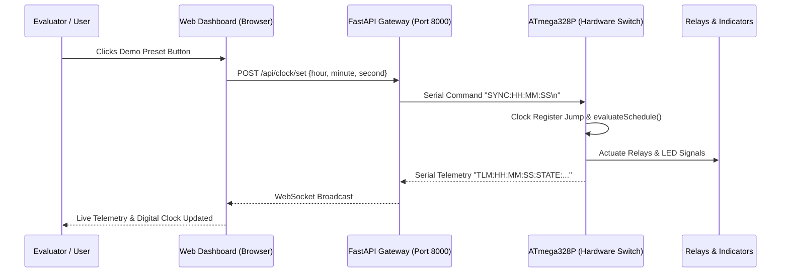

# State Simulation Jump (Demo Presets) Guide
**Smart In-Wall Automated Switch for Classroom Energy Conservation**  
**KICT & KOE Joint Project | Group ZLATANFC**

---

## Executive Summary

During formal project evaluations and live demonstrations, waiting for real-world time to elapse is impractical. The **State Simulation Jump [DEMO PRESETS]** interface on the web console provides instant, deterministic time synchronization to specific operational milestones.

When any preset button is pressed, the web client issues `POST /api/clock/set` with `{hour, minute, second}`, transmitting a raw `SYNC:HH:MM:SS` command over serial (`115200 baud`) to the ATmega328P microcontroller running [`smart_switch.ino`](../smart_switch/smart_switch.ino). The onboard state machine immediately re-evaluates the schedule and executes relay actuation, LED indication, and acoustic alerts in real time.

All preset calculations are calibrated to Room **E1-2-14** Monday schedule parameters:
* **Morning Academic Window:** `08:30 – 11:30`
* **Pre-Cooling Lead Time:** `10 minutes` (Starts at `08:20`)
* **Occupancy Grace Buffer:** `10 minutes` (Runs `11:30 – 11:40`)
* **Hard Power Cutoff:** `11:40:00`

---

## Quick Reference Matrix

| Preset Button | Jump Time | Firmware State | Lights (Yellow) | Air Conditioner (Blue) | Red LED Status | Buzzer Audio Behavior | Evaluation Focus |
| :--- | :--- | :--- | :--- | :--- | :--- | :--- | :--- |
| **08:25 PRECOOL** | `08:25:00` | `STATE_PRECOOL` | **OFF** | **ACTIVE** | **OFF** | 1800 Hz chime (80 ms) on entry | Thermal prep without lighting waste |
| **08:45 CLASS** | `08:45:00` | `STATE_CLASS_ACTIVE` | **ACTIVE** | **ACTIVE** | **OFF** | 2400 Hz chime (100 ms) on entry | Autonomous scheduled power delivery |
| **11:35 GRACE** | `11:35:00` | `STATE_GRACE_PERIOD` | **ACTIVE** | **ACTIVE** | **FAST BLINK (2 Hz)** | 1600 Hz ping (35 ms) every 15s | Non-disruptive pack-up safety buffer |
| **11:39:50 URGENT** | `11:39:50` | `STATE_GRACE_PERIOD` | **ACTIVE** | **ACTIVE** | **FAST BLINK (2 Hz)** | 2800 Hz pulses (50 ms) at 1 Hz | 10s rapid escalation & zero-waste cutoff |
| **12:00 STANDBY** | `12:00:00` | `STATE_STANDBY` | **OFF** | **OFF** | **SOLID ON** | Silent (800 Hz tone at transition) | Zero idle vampire power elimination |
| **DYNAMIC SWEEP** | *10s before Curfew* (`23:59:50`) | Curfew Transition | **ACTIVE** $\rightarrow$ **OFF** | **ACTIVE** $\rightarrow$ **OFF** | **FAST BLINK** $\rightarrow$ **SOLID ON** | 1100 Hz pulses (75 ms) at 1 Hz, 800 Hz cutoff | Night curfew sweep & override purge |

---

## Detailed Preset Specifications

### 1. `08:25 PRECOOL`
* **Simulated Clock Time:** `08:25:00`
* **Schedule Interval:** Within the automated pre-cooling window (`08:20 – 08:30`)
* **State Machine Enum:** `STATE_PRECOOL`
* **Physical Hardware Responses:**
  * **Relay Output (Lights / Yellow Pin 12):** `LOW` (**OFF**). Prevents artificial lighting energy waste in an empty room.
  * **Relay Output (AC / Blue Pin 13):** `HIGH` (**ACTIVE**). Compressor / fan engaged to reach thermal equilibrium.
  * **Front Panel LEDs:** Blue LED `ON`, Yellow LED `OFF`, Red LED `OFF`.
  * **Acoustic Indicator:** Emits a single entry chirp at **1800 Hz** (duration: 80 ms).
  * **7-Segment Display:** Renders `08:25` with ticking center colon.
* **Evaluator Talking Point:**
  > *"Class begins at 08:30. At 08:20, the system automatically begins pre-cooling the room so students and faculty enter a comfortable environment. Crucially, room lights remain completely powered off during this stage because nobody is inside yet, preventing wasteful illuminance consumption."*

---

### 2. `08:45 CLASS`
* **Simulated Clock Time:** `08:45:00`
* **Schedule Interval:** Fully inside active lecture session (`08:30 – 11:30`)
* **State Machine Enum:** `STATE_CLASS_ACTIVE`
* **Physical Hardware Responses:**
  * **Relay Output (Lights / Yellow Pin 12):** `HIGH` (**ACTIVE**). Full luminaires powered.
  * **Relay Output (AC / Blue Pin 13):** `HIGH` (**ACTIVE**). Continuous climate control.
  * **Front Panel LEDs:** Yellow LED `ON`, Blue LED `ON`, Red LED `OFF`.
  * **Acoustic Indicator:** Plays a 2-tone harmonic session-start chime at **2400 Hz** (duration: 100 ms) when entering class from pre-cool.
  * **7-Segment Display:** Renders `08:45`.
* **Evaluator Talking Point:**
  > *"Demonstrates normal academic operating hours. Power delivery to lighting and HVAC is completely autonomous based on timetable synchronization, eliminating human failure to turn on switches or adjust classroom settings manually."*

---

### 3. `11:35 GRACE`
* **Simulated Clock Time:** `11:35:00` (5 minutes remaining in grace period)
* **Schedule Interval:** Class officially ended at `11:30`; grace window active (`11:30 – 11:40`)
* **State Machine Enum:** `STATE_GRACE_PERIOD`
* **Physical Hardware Responses:**
  * **Relay Output (Lights / Yellow Pin 12):** `HIGH` (**ACTIVE**). Lights remain fully illuminated.
  * **Relay Output (AC / Blue Pin 13):** `HIGH` (**ACTIVE**). Air conditioning remains operational.
  * **Front Panel LEDs:** Yellow LED `ON`, Blue LED `ON`, Red LED **FAST BLINKING** at 2 Hz (`250 ms ON / 250 ms OFF`).
  * **Acoustic Indicator:** Gentle, non-startling reminder ping at **1600 Hz** (duration: 35 ms) every 15 seconds.
  * **7-Segment Display:** Renders `11:35`.
* **Evaluator Talking Point:**
  > *"Abruptly cutting off electricity right when a lecture finishes causes accidents and panic as students pack laptops in the dark. The system introduces an intelligent 10-minute Grace Period buffer where power is preserved, but the pulsing red pilot light and 15-second acoustic pings notify occupants that the automated shutdown timer is running."*

---

### 4. `11:39:50 URGENT`
* **Simulated Clock Time:** `11:39:50` (Exactly 10 seconds before hard cutoff at `11:40:00`)
* **Schedule Interval:** Terminal countdown of Grace Period
* **State Machine Enum:** `STATE_GRACE_PERIOD` with escalation
* **Physical Hardware Responses:**
  * **0 to 9 Seconds (`11:39:50` to `11:39:59`):**
    * Relays: Both Lights and AC remain **ACTIVE**.
    * Red LED: Continuous rapid flash (2 Hz).
    * Buzzer: Escalates to a distinct, urgent **2800 Hz** pulse (50 ms) emitted once every second on the second tick (:51, :52, :53... :59).
  * **At Zero (`11:40:00`):**
    * Relays: Both relays instantly de-energize (**OFF**) with an audible mechanical click.
    * Buzzer: Emits a descending power-cutoff tone at **800 Hz** (duration: 250 ms).
    * Red LED: Changes from flashing to **SOLID ON**.
    * System State: Drops into `STATE_STANDBY`.
  * **7-Segment Display:** Transitions from `11:39` to `11:40`.
* **Evaluator Talking Point:**
  > *"This is the highlight demonstration button. In a live evaluation, judges do not want to wait 10 minutes to observe a shutdown. Clicking 11:39:50 demonstrates the 1-second countdown alert cadence, and at 11:40:00 sharp, showcases the instantaneous relay disconnection and safe power termination."*

---

### 5. `12:00 STANDBY`
* **Simulated Clock Time:** `12:00:00`
* **Schedule Interval:** Midday vacant window between morning session and afternoon session
* **State Machine Enum:** `STATE_STANDBY`
* **Physical Hardware Responses:**
  * **Relay Output (Lights / Yellow Pin 12):** `LOW` (**OFF**).
  * **Relay Output (AC / Blue Pin 13):** `LOW` (**OFF**).
  * **Front Panel LEDs:** Red LED **SOLID ON** (indicating standby armed status), Yellow LED `OFF`, Blue LED `OFF`.
  * **Acoustic Indicator:** Completely silent.
  * **7-Segment Display:** Renders `12:00`.
* **Evaluator Talking Point:**
  > *"Proves the fundamental thesis of the project: eliminating phantom and idle energy waste in empty university lecture halls and laboratories during breaks, lunch hours, and weekends. All high-power branch circuits are uncoupled until the next scheduled academic session."*

---

### 6. `DYNAMIC NIGHT SWEEP` (e.g. `23:59:50 SWEEP`)
* **Simulated Clock Time:** Dynamically calculated as **10 seconds prior to configured curfew** (e.g. `23:59:50` for `00:00` midnight sweep, or `22:59:50` for `23:00`).
* **Schedule Interval:** Terminal countdown to policy-enforced night curfew sweep.
* **Physical Hardware Responses:**
  * **0 to 9 Seconds (`SS = 50` to `SS = 59`):**
    * Relays: If room was active / forced on, Lights & AC remain **ACTIVE**.
    * Red LED: **FAST BLINK (2 Hz)** warning pulse.
    * Buzzer: Distinctive **1100 Hz** industrial caution pulses (75 ms) at 1 Hz (unmistakably deeper and more authoritative than the 2800 Hz urgent grace chime).
  * **At Zero (`00:00:00` / Curfew):**
    * Relays: Any active overrides (`FORCE_ON`) are purged; relays instantly de-energize (**OFF**).
    * Buzzer: Emits power cutoff tone (`800 Hz, 300 ms`) and day transition chime (`3200 Hz, 80 ms`).
    * Red LED: Transitions from flashing to **SOLID ON** (Standby pilot).
    * System State: Enters `STATE_STANDBY`.
  * **7-Segment Display:** Displays `23:59` $\rightarrow$ `00:00` with day banner splash.
* **Evaluator Talking Point:**
  > *"What happens if students or janitorial staff manually turn switches on and leave them burning all night? This button tests the automated Night Sweep Curfew. It jumps to 10 seconds before curfew, plays an authoritative 1100 Hz countdown pulse, and at midnight sharp, automatically purges all overrides and locks the room into zero-waste standby."*

---

## Communication Architecture

---

## Technical Appendix: Firmware References

* **State Definitions:** [`smart_switch.ino#L124-L129`](../smart_switch/smart_switch.ino#L124-L129)
* **Audio Alerts & Transition Frequencies:** [`smart_switch.ino#L520-L568`](../smart_switch/smart_switch.ino#L520-L568)
* **Output Actuation Engine:** [`smart_switch.ino#L611-L637`](../smart_switch/smart_switch.ino#L611-L637)
* **Web Preset Buttons:** [`web/static/index.html#L169-L178`](../web/static/index.html#L169-L178)
* **Time Sync Dispatcher:** [`web/static/app.js#L1203-L1222`](../web/static/app.js#L1203-L1222)
